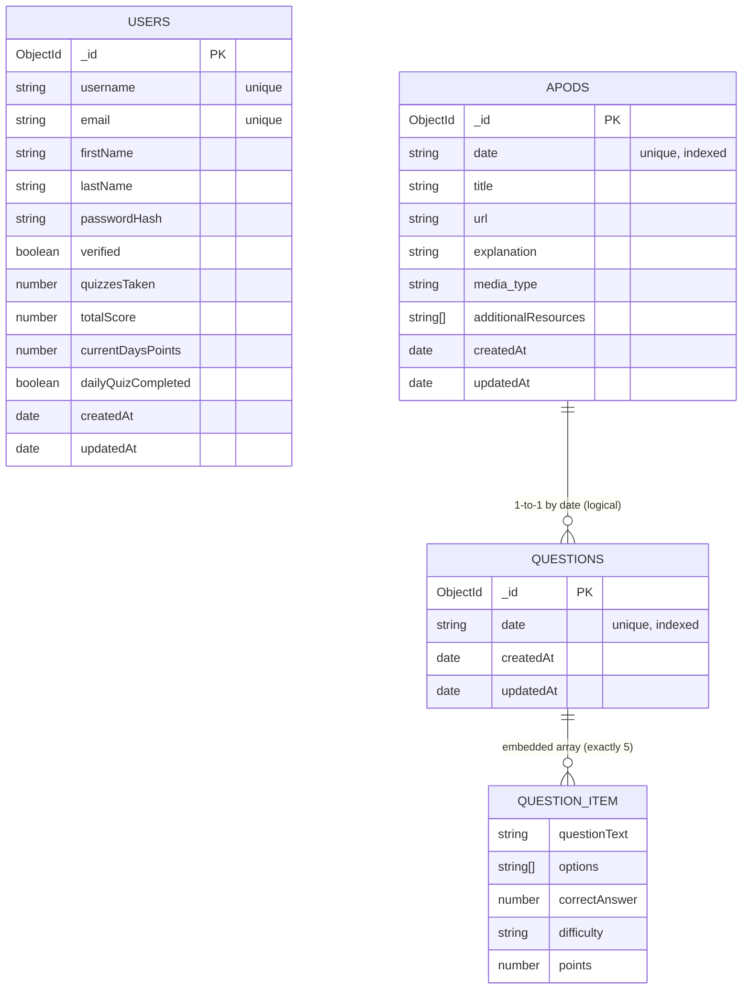

# AstroQuizzer MongoDB ERD

This file contains an ERD (Mermaid) diagram for the three collections in your MongoDB database: `users`, `apods`, and `questions`.

Paste the Mermaid block below into the Mermaid Live Editor (https://mermaid.live) or open in VS Code with a Mermaid preview extension.

Notes:
- `questions` documents store an embedded array (exactly 5) of question objects; I represented that embedded object as `QUESTION_ITEM` in the ERD.
- `APODS.date` and `QUESTIONS.date` are strings in your models (format YYYY-MM-DD) and act as the linkage (logical FK) between APOD and Questions.
- `USERS` currently stores metrics on the document (no submissions collection present).

How to preview
- Option A (quick): Open https://mermaid.live and paste the Mermaid block above. Click "Render". Export SVG/PNG.
- Option B (VS Code): Install "Markdown Preview Mermaid Support" or "Mermaid Markdown Syntax Highlighting" and open `docs/ERD.md`.
- Option C (draw.io/diagrams.net): Manually draw boxes and arrows using the diagram editor.

If you want I can:
- Export a PNG/SVG of this diagram and add it to the repo under `docs/`.
- Generate a PlantUML/PNG file instead.
- Create a dbdiagram.io or draw.io file and push it to the repo.

Which output do you prefer?